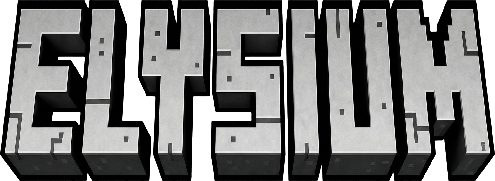

<p align="center">
  
</p>

<h3 align="center">The open-source alternative to Minecraft: Java Edition.</h3>

<p align="center">
  <em>A complete block-survival game, built from scratch in Swift + Metal.<br>
  Every sound synthesized in real time. Every chunk carved from noise.</em>
</p>

<p align="center">
  
</p>

---

**Pebble** is the open-source alternative to Minecraft: Java Edition — a native macOS voxel survival game with the full overworld/nether/end progression: worldgen, mobs, redstone, crafting, enchanting, brewing, villages, raids, and boss fights — implemented in **~63,000 lines of Swift** with **zero external dependencies**. No game engine, no .xcodeproj. The renderer is hand-written Metal, the audio engine synthesizes every sound from oscillators at runtime, and the game looks the way it does thanks to [Faithful 32x](https://faithfulpack.net) as its built-in texture set.

Pebble is an original fan re-creation inspired by Minecraft: Java Edition 1.20. It is **not affiliated with, endorsed by, or connected to Mojang Studios or Microsoft** in any way, and contains no Mojang code or assets. Full statement in [Disclaimer](#disclaimer) below.

> **Pebble 1.1.0 is a beta.** The engine is pinned by 457 golden regression checks, but a game of this scope absolutely has bugs we haven't found yet — we just don't know where they are. If you hit one, [opening an issue](https://github.com/thebriangao/pebble/issues) would mean the world to us, and a pull request with a fix even more. See [Reporting bugs & contributing](#reporting-bugs--contributing) for what to include.

## By the numbers

| | |
|---|---|
| Lines of Swift | ~63,000 source lines across 96 source files |
| External dependencies | **0** (Apple frameworks only) |
| Blocks | 879 |
| Items | 1,194 |
| Biomes | 63 (overworld, nether, end, cave biomes) |
| Entity types | 100 (55+ mobs with full AI, vehicles, projectiles) |
| Structures | 19 types, 30+ variants (villages, strongholds, bastions, end cities, ancient cities…) |
| Golden regression checks | 457, all green (`swift run -c release pebsmoke`) |
| Renderer | Metal, 15+ passes, runtime-compiled MSL |
| Textures | [Faithful 32x](https://faithfulpack.net) by the Faithful team (third-party, fully credited) |
| Audio assets | 0 — fully synthesized (AVAudioSourceNode + biquad filters) |
| Performance | 200+ fps at full fancy settings on an Apple-silicon MacBook Air |
| World load | ~2–4 s cold |

## Features

- **Full survival loop** — mining with tool tiers, food that restores health while feeding hunger/saturation, XP, sleeping, fall damage, drowning, fire, status effects, death messages, durable bed/respawn-anchor spawn points, respawn/keep-inventory game rules.
- **Worldgen** — multi-noise climate sampling (temperature/humidity/continentalness/erosion/weirdness) through spline-driven terrain, 3D density caves (cheese/spaghetti/noodle), ravines, aquifers, ore distribution per vanilla 1.20 tables, snow lines, and 63 biomes including lush caves, dripstone caves, and the deep dark. The Create New World screen exposes Java-style world types: Default, Superflat, Large Biomes, Amplified, Single Biome with a selectable biome, and the hidden Option-click Debug Mode grid, plus Pebble's custom Moderate Hills - Resource Rich preset with rolling hills, doubled ore/resource attempts, and rare large caverns. New maps also choose a per-world dungeon density from None through Many; Normal is the legacy/default density, while higher levels double the independent dungeon-placement passes at each step.
- **Three dimensions** — overworld, nether (fortresses, bastions, all five nether biomes), and the end (dragon fight, end cities, gateways), connected by working portals.
- **Structures** — villages with professioned villagers and working trades, strongholds with the portal room, mineshafts, desert/jungle temples, igloos with basements, witch huts, ocean monuments and ruins, shipwrecks, buried treasure, ruined portals, woodland mansions, amethyst geodes, ancient cities with sculk and shriekers.
- **Mobs & AI** — 55+ mobs with A* pathfinding, goal-based AI (breeding, taming, fleeing, pack hunting), villager gossip and trades, piglin bartering, raids with waves and Hero of the Village, and the three bosses: Ender Dragon, Wither, Warden (with vibration detection).
- **Redstone** — wire networks with 0–15 power levels, repeaters with locking, comparators that read containers, pistons with quasi-connectivity and slime/honey push sets, observers, dispensers, hoppers, rails, sculk sensors.
- **Items & systems** — shaped/shapeless/tag crafting with recipe menus that auto-fill available ingredients and output-slot arrows for choosing multi-craft quantities, copper sword/pickaxe/axe/shovel/hoe recipes with copper-ingot repair, crafting tables that can draw from containers within 25 blocks and keep a shared 3x3 station grid, smelting in three furnace types, brewing, enchanting with 39 enchantments and a compatibility matrix, anvils, grindstones, smithing with armor trims, stonecutters, loot tables with fortune/looting, fishing, archaeology with sherds and decorated pots, advancements, and the craftable Flying Wand combat tool.
- **Creative mode** — instant block breaking, flight, an infinite hotbar, and full player invulnerability while building. Survival players can also fly while the Flying Wand is selected, but unequipping it midair forces a fall with half normal fall damage.
- **RPG classes and actions** — optional per-world RPG rules add character creation, six class paths, attributes, class XP/levels, prepared passive skills, prepared active skills, fatigue, spell circles, and deterministic procedural icons for every path, branch, skill, spell, and RPG action. The HUD adds a second 1-9 RPG quick-slot row above the normal hotbar; prepared spells and active skills can be slotted from the character sheet and triggered with Shift+1 through Shift+9. Casters and non-casters use the same quick-slot action path, so prepared spells and active skills both spend fatigue, enter cooldown, and resolve through existing world/entity systems. LAN clients send typed RPG intents only; hosts keep RPG state authoritative and execute remote spell/skill actions through ghost players.
- **Live map overlay** — a square minimap sits flush against the lower-right HUD edge, centered on the player, and defaults to the medium of three compact sizes. Use `-` / `=` to cycle the compact size, press M to pop it into a large draggable map, and use `,` / `.` to zoom from the loaded-world overview down to roughly 100 blocks around the player.
- **Object templates** — point the center crosshair at a connected construction and press Command-C to name and save it as a local template, then press Command-V to open the saved-template browser and choose an object to place. Copying follows face- and edge-connected non-environment blocks so detailed constructions with edge-only attachments are captured without pulling in terrain substrate. Copied containers keep the container block and non-inventory block-entity metadata, but their item slots and deferred loot are saved empty. Saved templates support up to 524,288 blocks inside the existing 96-block span cap, are stored as compact SQLite binary blobs with summary metadata, and still read legacy JSON records. The browser automatically previews the selected object in the right 3D panel and includes a Delete button for removing saved templates. Placement preview captures the pointer, floats a bounded wireframe of the saved 3D object in the view center, rotates it in 90-degree steps with the mouse wheel, and commits on left click with blocks and block entities reattached. Placement automatically clears blocks inside the object volume and fills foundation gaps under the footprint with adjacent terrain material when the selected location is uneven. Large placement commits are tick-sliced so the game remains responsive while progress is shown in the action bar. Press Command-Z in world mode to undo the most recent object placement, removing the placed object and restoring the cells that placement cleared or filled. Legacy commands remain available: `/clone the target with new name "name"`, `/place "name"`, and `/listTemplates`.
- **LAN multiplayer sessions** — open the Multiplayer screen from the title menu or "Open to LAN" from the pause menu to host, browse, or join a player-started local-network game. The Join World button connects to the selected discovered LAN world, or to the typed manual host/port when no discovered world is selected. Pebble advertises `_pebble-lan._tcp` with Bonjour, requires a short join code before accepting a peer, and exposes `/lan host`, `/lan browse`, `/lan join`, `/lan direct`, `/lan say`, `/lan status`, and `/lan stop` for command-line control. The shipped network layer supports bounded protocol frames, handshake, LAN discovery, Direct Connect, peer status, LAN chat, host-authoritative replication batches for player state, synchronized time/weather/difficulty, smoothed remote-player rendering, visible-neighborhood chunk sections, block deltas, dirty chunk-section snapshots for large object placements, item-bearing block entities such as chests, hoppers, furnaces, brewing stands, and crafting-table grids, revision-gated mirrored container/crafting screens on clients with host-validated item conservation and double-chest transactions, host-authoritative remote use for openable doors/trapdoors/fence gates, per-host-world guest resume positions and inventories, loaded animal/monster/plant/dropped-item/XP snapshots, and host-owned inventory/XP snapshots so remote players can collect host-owned monster drops, plus remote player entities and host permission gates for build/container/crafting/template/command/AI/creative/dimension/death/respawn/reconnect flows. Public internet/NAT traversal and cloud relay are not included.
- **Local AI agent** — press T and run `/ai <request>` to ask a configured local Ollama model to inspect the current game state and choose one whitelisted Pebble skill through Ollama tool calls or the structured-output fallback. Skills can give registered items, place or replace registered blocks at the cursor, break/use the cursor block through normal interaction paths, fill bounded cursor regions, level dirt-adjacent holes in front of the player, rework the loaded current biome into bounded rolling resource-rich hills, set time/weather/difficulty/gamerules, spawn or remove count-capped nearby registered entities, modify local player state (gamemode, food use, health, damage, effects, inventory, XP, spawnpoint, surface teleport), inspect saved object templates, edit their block composition, or create bounded generated templates such as pirate ships. Direct requests like `/ai fill the hole in front of me with dirt`, `/ai change the current biome to rolling hills with rich resources`, `/ai set time to night`, `/ai make it rain`, `/ai spawn two zombies at the cursor`, `/ai change the type of all wood blocks in "house" to bamboo`, and `/ai create a object that looks like a pirate ship about 50 blocks long ... Name the object pirateShip` are handled deterministically and saved in the same template store as player-copied objects where applicable. The model preference lives in Options -> AI, only talks to `http://localhost:11434`, and filters/rejects cloud-tagged Ollama models.
- **Vanilla-exact player physics** — walk 4.317 b/s, sprint 5.612 b/s, jump apex 1.2522 blocks, sprint-jumping, water/lava/elytra movement, ice slipperiness, soul sand, honey — verified by independent-derivation tests in the suite.
- **Faithful 32x textures, built in** — the complete [Faithful 32x](https://faithfulpack.net) art (third-party, fully credited — see [Disclaimer](#disclaimer)) ships inside the app and loads through Pebble's own zip/`.mcmeta` reader: atlas textures, animations with interpolation, GUIs, fonts, entity skins, and sun/moon art. Self-restoring if the file goes missing.
- **Ultra graphics** — a built-in enhanced pipeline: SSAO, shadow-marched volumetric god rays, Poisson soft shadows, and ACES tonemapping. One toggle in Options → Video.
- **Generative music** — no audio files anywhere; ambient music, jukebox discs, and all ~hundreds of sound effects are synthesized from oscillator/noise recipes with envelopes, vibrato, positional stereo, underwater lowpass, and cave reverb.

## Recent extension highlights

Recent work has expanded the beta from a single-player survival recreation into a broader local sandbox with stronger editing, multiplayer, and automation surfaces:

| Area | Enhancements |
|---|---|
| LAN multiplayer | Player-started "Open to LAN" hosting, title-screen browsing, Direct Connect, short join-code handshakes, LAN chat/status commands, host-authoritative player/world replication, visible-neighborhood chunk streaming, synchronized time/weather/difficulty, smoothed remote players, host-owned item/XP pickup, per-host-world guest resume records, and permission gates for build/container/crafting/template/command/AI/creative/dimension/death/respawn flows. |
| Shared world state | Replication now covers block deltas, dirty chunk-section snapshots, item-bearing block entities, mirrored chest/furnace/brewing/crafting screens, double-chest transactions, host-validated crafting/container edits, openable door/trapdoor/fence-gate use intents, dropped items, XP orbs, mobs, plants, and remote player entities without allowing clients to author raw world state. |
| Object templates | Command-C/Command-V object workflows now copy edge-connected constructions without terrain flood-fill, keep cloned container inventories empty, save compact binary `PBT2` template blobs with summary columns, preview and delete templates in a browser, place with rotatable 3D wireframes, auto-clear obstructions, fill foundation gaps, support one-shot undo, and handle up to 524,288 blocks inside the 96-block span cap. |
| Large template safety | Local placement, LAN guest placement, LAN undo, and graceful quit paths are tick-sliced or drained so large object mutations do not leave half-written worlds; large mutations use chunk-section snapshots instead of overflowing per-block replication queues. |
| World creation | Create New World now exposes Java-style presets: Default, Superflat, Large Biomes, Amplified, Single Biome with biome selection, and Option-click Debug Mode. Pebble also adds Moderate Hills - Resource Rich, a custom rolling-hill preset with doubled ore/resource attempts and rare large caverns. Each new world stores its dungeon density too: None disables random dungeons, Normal preserves the previous generator, and More/Plentiful/Many double independent dungeon passes over the previous level. |
| Local AI agent | `/ai` can give registered items, place/replace/break/use cursor blocks, fill bounded cursor regions and dirt-rimmed holes, set time/weather/difficulty/gamerules, spawn/remove count-capped entities, modify local player state, inspect/edit saved templates, generate bounded pirate-ship templates, and rework the loaded current biome into rolling resource-rich hills. Ollama output is still treated as untrusted data and reduced to whitelisted symbolic skills. |
| Items and survival tools | Added the Flying Wand for survival flight with fall-damage tradeoffs, copper sword/pickaxe/axe/shovel/hoe recipes with copper-ingot repair, copper durability between stone and iron, iron-tier harvest capability for the copper pickaxe, and Faithful-style copper tool icons derived from matching iron pack art when copper art is absent. |
| Crafting and inventory UX | Recipe popups gained type-to-select search and output-slot quantity arrows; crafting tables can draw from nearby containers and persist station grids; food use now follows the hotbar left-click survival flow; creative inventory toggles and survival inventory transitions are hardened. |
| Map and rendering polish | The HUD minimap has three compact sizes, a draggable expanded map, bounded pan/zoom over loaded chunks, and screenshot hooks. Torch and lantern items render as material-built 3D fixtures instead of flat sprites, and non-block item icons prefer texture-pack art before deterministic procedural fallbacks. |
| Verification and hardening | The golden suite now reports 457 checks, preserving frozen item/recipe prefixes while allowing appended content. The local pipeline covers architecture checks, source security scan, Faithful asset verification, warning-free release build, binary security checks, XCTest, `pebsmoke`, deployment to `/Applications/Pebble.app`, and installed-app verification. |

## Install

Requirements: **macOS 14+** and the Xcode command-line tools (`xcode-select --install`). Apple silicon recommended.

```bash
git clone https://github.com/thebriangao/pebble.git && cd pebble
./pebble install
```

That builds in release mode, assembles a signed `Pebble.app`, installs it to `/Applications`, removes any legacy `~/Applications/Pebble.app`, and links the `pebble` CLI onto your PATH.

```
./pebble install    build from source and install /Applications/Pebble.app
pebble update       pull the latest version, rebuild, swap the live app
pebble run          launch Pebble
pebble test         run XCTest plus the 457-check golden suite
```

For development you can also run straight from the checkout — `swift run -c release Pebble` — and the app will find its packaged assets in `packaging/`.

## Controls

WASD to move, mouse to look, Space to jump, Shift to sneak, Ctrl (or double-tap forward) to sprint, E for inventory, Esc to pause. Press T for chat and slash commands, including `/ai <request>` when a local Ollama model is configured. Use `/lan help` for LAN hosting, browsing, Direct Connect, status, and LAN chat commands. The chat/command line wraps long text, scrolls output with the mouse wheel or trackpad, and Tab-completes registered item ids. Crafting recipe popups support type-to-select search, Backspace/Delete correction, and Enter selection; the up/down arrows beside the crafting output slot increase or decrease the selected craft quantity up to the resources available in survival or the receiving inventory capacity in creative. Press K to open character creation or the character sheet when RPG classes are enabled, or use the Character button from the E inventory screen. The sheet has a nine-slot RPG action row: select a slot, click a prepared spell or active skill to slot it, then use Shift+1 through Shift+9 in world mode to trigger the matching second-row quick slot. Press M to toggle the map between the lower-right minimap and a large draggable map; `-` / `=` cycle the minimap through small, medium, and large sizes, and `,` zooms out and `.` zooms in in both modes, while the expanded map also pans by mouse drag or arrow keys. Left click with food selected in the hotbar eats one unit when it can restore health or hunger. For object templates, point the center crosshair at an object and press Command-C to copy it, then press Command-V to browse saved objects and start placement; the browser previews the selected object automatically and its Delete button removes the selected saved template. Command-Z in world mode undoes the most recent object placement. Legacy commands are `/clone the target with new name "name"`, `/place "name"` (including `/place object "name" at the cursor` and `/place "name" at target` aliases), and `/listTemplates` (alias `/templates`). While placing a template, scroll rotates the pending object, left click places it after bounded auto-clearing/foundation filling, and Esc or right click cancels. In creative mode, or in survival while the Flying Wand is selected, double-tap Space to fly; Space ascends and Shift descends while airborne. Unequipping the Flying Wand while airborne drops the player and halves the resulting fall damage. F1 hides the GUI, F3 toggles the debug overlay, F11 toggles fullscreen (also in Options → Video). Scroll the normal hotbar with the wheel or trackpad. Everything is rebindable in Options → Controls.

## Where things live

| Path | What |
|---|---|
| `~/Library/Application Support/Pebble/pebble.db` | All worlds, chunks, players, advancements, object templates, and per-guest LAN reconnect records (single SQLite database) |
| `~/Library/Application Support/Pebble/settings.json` + `keybinds.json` | Settings and keybinds |

To uninstall completely: delete `/Applications/Pebble.app`, `~/Library/Application Support/Pebble/`, and the `pebble` symlink on your PATH (`/opt/homebrew/bin/pebble` or `/usr/local/bin/pebble`).

## Project layout

```
Sources/PebbleCore/   the engine — headless, no AppKit, fully testable
  Core/               deterministic math: fdlibm trig, seeded RNG, simplex noise
  World/              chunks, block registry (879), light engine, block entities
  Gen/                terrain, biomes, features, all structures
  Entity/             100 entity types, AI, pathfinding, player physics
  Items/              item registry (1,194), recipes, enchants, potions, loot
  Systems/            interact, redstone, fluids, farming, combat, raids, portals
  Render/             section mesher, texture atlas, entity models
  Net/                LAN protocol messages, replication batches, bounded frame codec, validation
  Game/               GameCore tick orchestrator, SQLite saves, settings
Sources/Pebble/       the macOS app — window, Metal renderer, UI, audio, input, LAN transport
Sources/pebsmoke/     golden test harness (457 checks against goldens/*.json)
Tests/PebbleCoreTests/ focused XCTest coverage for templates, LAN, saves, settings, UI helpers, and gameplay systems
goldens/              golden baseline files pinning engine behavior
packaging/            Info.plist, icon, logo, title art, bundled Faithful textures
pebble                the build/install/test CLI
```

A deeper tour lives in [ARCHITECTURE.md](ARCHITECTURE.md).

## The determinism contract

Pebble's engine is **fully deterministic**: a portable fdlibm implementation of `sin/cos/atan2` (pure IEEE-754 operations, no platform math library), 32-bit-wrapping integer hashes, and seeded RNG everywhere mean the same seed produces the identical world — bit for bit, on any machine, across releases. That contract is enforced by golden baseline files: `swift run -c release pebsmoke` runs 457 checks covering terrain hashes over full chunk pipelines, a 55-mob zoo ticked 200 steps and compared at checkpoints, 911 transcendental-math probes, recipe/enchant/loot RNG lockstep, a redstone contraption timeline, and independent derivations of vanilla physics constants. `pebble test` runs the SwiftPM XCTest target first, then the golden suite. The goldens are the contract that keeps the engine honest — a change that moves a single block in an existing world fails the suite.

## Development hooks

Useful environment variables for testing and automation:

| Variable | Effect |
|---|---|
| `PEBBLE_AUTOLOAD=1` | skip menus, load the most recent world |
| `PEBBLE_NEWWORLD=<seed>` | create a fresh world with that seed (worldgen testing) |
| `PEBBLE_DUNGEON_DENSITY=1...5` | with `PEBBLE_NEWWORLD`, create that fresh world with dungeon density 1 none, 2 normal, 3 more, 4 plentiful, or 5 many |
| `PEBBLE_CMD="/tp 0 120 0;/time set 1000"` | run chat commands once the world is up |
| `PEBBLE_RPG_AUTOCREATE=1` | create a debug RPG character once an autoloaded world is up, using `PEBBLE_RPG_PATH`, `PEBBLE_RPG_STARTER`, and optional comma-separated `PEBBLE_RPG_SPELLS` |
| `PEBBLE_OPEN_SCREEN=inventory`, `templates`, `templatesPlace`, `creative`, `map`, or `rpg` | open an allowlisted UI screen for screenshot smoke tests |
| `PEBBLE_SHOT="/tmp/x.png@300"` | capture a frame N frames after load |
| `PEBBLE_LAN_AUTOJOIN="<host> <port> <joinCode> [name]"` | test hook that joins a LAN host from the title screen through Direct Connect |
| `PEBBLE_LAN_PROBE=host-rig`, `client-door`, or `client-resume` | test hook used by `scripts/live-lan-test.sh` to prove two-Mac LAN door use, block-entity snapshot sharing, and guest resume position |
| `PEBBLE_WORLDS=1` | jump straight to the world-select screen |
| `PEBBLE_BOT=1` | run the physics validation bot through the real input path |
| `PEBBLE_PHOTOBOOTH=1` | studio rig that captures every mob and block to PNGs (`PEBBLE_BOOTH_MOBS=cow,sheep` / `PEBBLE_BOOTH_BLOCKS=-` to filter) |
| `PEBBLE_PROF=1` | print per-stage load/tick timings |
| `PEBBLE_PACKDEBUG=1` | log texture tile coverage and entity-skin resolution |
| `PEBBLE_GEOM_DEBUG=1` | log entity geometry construction |
| `PEBBLE_REGOLD=1` | **rewrites golden baselines** — see CONTRIBUTING before using |

## Release pipeline

For an end-to-end local release gate:

```bash
./scripts/pipeline.sh
```

That runs architecture checks, source security scans, bundled Faithful asset verification, a warning-free release build, binary security checks, XCTest, the 457-check golden suite, install to `/Applications/Pebble.app`, and a final installed-app binary verification.

## Reporting bugs & contributing

**Contribution is incredibly welcome.** This is a first public beta: the engine is golden-tested, but the bug list is unknown by definition — the bugs are out there, and you will find them before we do. Every report genuinely helps.

Found a bug? [Open an issue](https://github.com/thebriangao/pebble/issues). To help us identify and fix it, please include:

- **macOS version and Mac model/chip** — e.g. "macOS 15.2, M2 MacBook Air".
- **Pebble version** — bottom-left of the title screen.
- **What you did, what happened, what you expected** — rough steps to reproduce are fine.
- **World context** if it's an in-world bug: the **seed**, the **dimension**, and your **coordinates** (the F3 overlay shows all three).
- **Settings that matter**: render distance and whether ultra graphics are on.
- **Screenshots or video** for anything visual.
- For crashes: the crash report from `~/Library/Logs/DiagnosticReports`, and terminal output if you launched with `pebble run` from a terminal.
- If the engine itself seems wrong (worldgen, physics, redstone): the tail of `pebble test` — it should print `457 passed, 0 failed`.

Even better than a bug report is a **pull request with a fix** — see [CONTRIBUTING.md](CONTRIBUTING.md) for the build/test workflow and the conventions that are load-bearing (registration order, RNG discipline, determinism rules). PRs of all sizes are wanted, from typo fixes to subsystem work.

- [CONTRIBUTING.md](CONTRIBUTING.md) — build, test, golden workflow, load-bearing conventions.
- [SECURITY.md](SECURITY.md) — threat model and how to report vulnerabilities privately. Pebble's network surfaces are player-started LAN multiplayer and the optional loopback-only local Ollama agent.
- [LAN_MULTIPLAYER_PLAN.md](LAN_MULTIPLAYER_PLAN.md) — local-network multiplayer design/security plan, implemented replication layer, and remaining gameplay work.
- [LICENSE](LICENSE) — MIT, covering the code in this repository. The bundled Faithful artwork is third-party content under its own terms.
- [CHANGELOG.md](CHANGELOG.md) — release history.

## Disclaimer

**Pebble is an independent, original fan re-creation. It is not an official Minecraft product. It is not affiliated with, endorsed by, sponsored by, or connected to Mojang Studios, Microsoft Corporation, or any of their subsidiaries, in any way.** "Minecraft" is a trademark of Mojang Synergies AB / Microsoft; Pebble does not use the name in the software and claims no association with the trademark holders.

Pebble's *gameplay design* is inspired by Minecraft: Java Edition 1.20 — game rules and mechanics reimplemented from publicly observable gameplay. Concretely:

- **No Mojang/Microsoft source code is used.** Every line of game code was written for this project by its author — the sole third-party-derived code is the fdlibm trigonometry port in `Sources/PebbleCore/Core/DetMath.swift` (Sun Microsystems' permissive license, notice preserved there). Nothing is decompiled, disassembled, copied, or derived from Minecraft's code.
- **No Mojang/Microsoft asset files are included.** The engine's texture atlas is generated by code; the default visual layer is the third-party Faithful 32x pack (credited below — the Faithful team's own artwork); sounds and music are synthesized in real time from oscillator recipes; fonts are a built-in bitmap glyph set; entity models are hand-written Swift reproducing the vanilla mobs' publicly documented box dimensions and UV layouts — required for Java Edition-format entity textures to map onto them correctly. There are no extracted game files anywhere in this repository.
- Pebble is free, open-source, and non-commercial. It does not include telemetry, analytics, update checks, NAT traversal, relay servers, or account services. Network activity is limited to player-started LAN multiplayer and the optional `/ai` agent, which can call only local Ollama on loopback when the player explicitly uses it.

**Third-party content:** the app bundle ships the complete, unmodified [Faithful 32x](https://faithfulpack.net) (1.20.1) as its built-in texture set. That artwork is the work of the Faithful team and its contributors, distributed under the [Faithful License](packaging/FAITHFUL-LICENSE.txt) (included verbatim here and in the app bundle, as it requires) — it is **not** covered by this repository's MIT license. Pebble is free and non-commercial, consistent with that license's no-monetization requirement. If anyone with rights in that artwork prefers it not be bundled, contact the address below and it will be removed promptly; Pebble remains fully functional without it. Pebble's ability to *read* the file format the artwork ships in is an independently implemented compatibility feature and implies no affiliation.

Pebble is provided "as is", without warranty of any kind (see [LICENSE](LICENSE)). It writes only to `~/Library/Application Support/Pebble/` and `/Applications/Pebble.app`. Questions, concerns, or good-faith takedown requests from rights holders: **briangaoo2@gmail.com** (subject starting with `[pebble]`) — they will be honored quickly.

---

<p align="center"><em>Open to LAN.</em></p>
